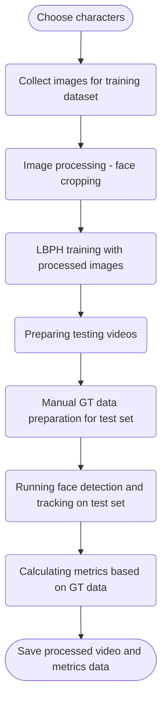

Face detection and tracking project for 2D image processing course (2023).
As a source of testing videos I have chosen GoT first few episodes (because it contained a multitude of characters). Ten characters have been chosen and a training dataset has been prepared. For optimized work with testing dataset several util methods have been used to crop faces out of sample images etc. 

Project's general workflow:

# The workflow in detail:

Approaches tried before:
1) DNN face detector
2) LBP face detector (trained with negative images)
3) Pre-trained cascade classifier (for comparison)
Can find in alt_train.py
Several trackers tried: boosting (found out it drifts out), MIL and MOSSE (shows better results)

# Pre-processing, creating dataset and training:

- Prepared character images from GOT 
- Faces cutout automatically with MTCNN 
- Manual post-processing of faces, remove badly detected faces
- Prepare training dataset with the cutout faces 
- Train local binary patterns histograms (LBPH) yml file

# Face detection, recognition and post-processing:

- MTCNN face detector for every 10th frame  
- MOSSE tracker for tracking the faces  
- Using pre-trained yml file to compare face histograms 
- Comparing label to list of characters 
- Adding face rectangle and label to the frame 
- Saving the video

## Challenge 1: 
Characters grow beards / grow up over several seasons of the show >> facial features change >> decided to only take videos from the first season and only use children faces from the first season too >> results improved

## Challenge 2: 
Some characters video is a fusion of several character appearances to compensate short screen time (< 100 frames) or frames rate is increased for the same reason.

## Challenge 3: 
Bad recognition results >> Extended the training dataset.

Number of images per character is really low, but LBPH is still showing good results on cutout testing videos.

# Metrics calculation: 
For face location, compare the center of the face rectangle to ground truth manual annotation. The face is considered to be located similarly if the center of the rectange does not differ in position to a tolerance of half of rectangle height (dynamic tolerance value considers different face size). For correctly located faces the program compares character label IDs. If the IDs match the detection is considered True Positive. If the IDs don't match, but some face is detected, the detection is considered False Positive. The rest of the detections are False Negative (no detection or detected far away from the intended location).
TLDR: Face detected and character correct > True positive, face detected but character not correct > False Positive, face detection is wrong > False Negative.
The F1 score is then calculated for an entire video using formula: 
F1 = 2*(Precision*(Recall))/(Precision+Recall)

# F1 score for video files:

### Isaac:                                  
[1-1]     F1 = 1.0                                
[1-2]     F1 = 0.818                             

### Maisie:     
[2-1]     F1 = 1.0 
[2-2]     F1 = 1.0 

### Kit: 
[3-1]     F1 = 1.0 
[3-2]     F1 = 1.0 

### Emilia:    
[4-1]     F1 = 0.733
[4-2]     F1 = 0.933

### Sophie:      
[5-1]     F1 = 0.706
[5-2]     F1 = 0.896

### Peter: 
[6-1]     F1 = 0.777
[6-2]     F1 = 1.0 

### Lena:    
[7-1]     F1 = 1.0 
[7-2]     F1 = 0.666

### Alfie:   
[8-1]     F1 = 1.0 
[8-2]     F1 = 1.0 

### Iain:    
[9-1]     F1 = 1.0 
[9-2]     F1 = 0.960

### Sean: 
[10-1]     F1 = 1.0    
[10-2]     F1 = 0.947

### Overall average F1 score:    
F1 = 0.922 > 0.8

